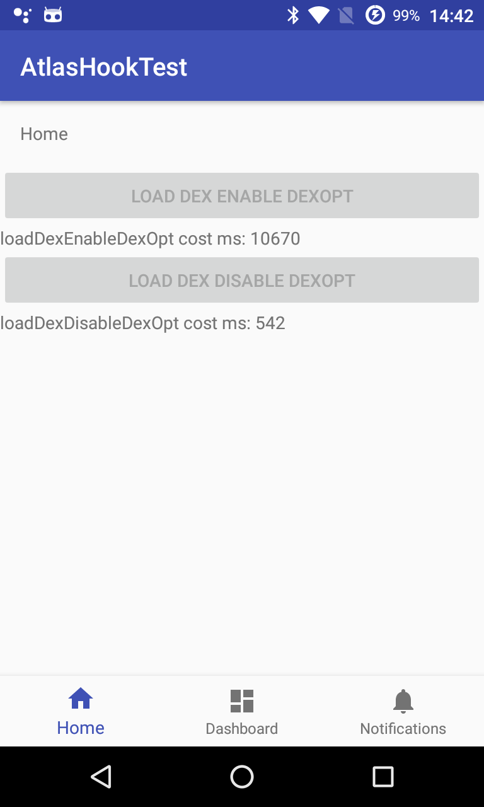

# AtlasHookTest

在 Android 中使用 DexClassLoader 加载一个 **未优化** 的 dex/apk/jar 文件会比较耗时。这在 Android 5.x 开始采用 ART 虚拟机后更加明显。消耗的时间主要是做 dex **优化**

- Dalvik 虚拟机: *dexopt*
- ART 虚拟机: *dex2oat*

插件框架需要通过 DexClassLoader 动态加载插件，首次加载插件需要耗费比较长的时间。

在阅读 [alibaba/atlas][1] 代码时，发现其使用 `atlas-core/libs/armeabi/libdexinterpret.so` 和 `atlas-core/libs/android-art-interpret-3.0.0.jar` **禁用** dex2oat 达到加速 load dex 的效果

该项目用于测试其加速 load dex 的效果, 项目中的以下文件均来自于 [alibaba/atlas][1]

- `app/libs/armeabi/libdexinterpret.so`
- `app/libs/android-art-interpret-3.0.0.jar`

测试设备 Nexus 4 CM13 Android 6.0.1 ART 虚拟机，模拟插件的 APK 为 assets 中的 `com.dijkstra.notely.apk` ，大小： 2.6M。测试结果
  - 启用 *dex2oat* 加载该 APK 耗时：10 秒
  - 禁用 *dex2oat* 加载该 APK 耗时: 500 毫秒

**注意**

禁用 *dex2oat* 后，由于插件中的代码没有经过优化，执行效率会低一些。因此，建议的做法是

1. 首次加载插件时 **禁用** *dex2oat* ，快速把插件加载起来
2. **启用** *dex2oat*, 在后台线程中调用 `DexFile.load` 加载插件，让系统对其进行 *dex2oat*
3. 后续非首次加载插件时，由于已生成了优化后的 dex ，系统不会再进行 *dex2oat*，插件加载会非常快

# 相关项目

- [alibaba/atlas][1]
- [asLody/TurboDex][2]

[1]: https://github.com/alibaba/atlas
[2]: https://github.com/asLody/TurboDex
